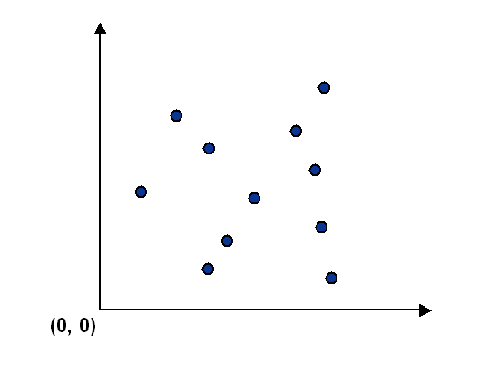
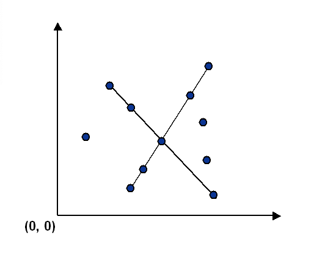

# Collinear Points
&nbsp; &nbsp; &nbsp;    &nbsp;Computer vision involves analyzing patterns in visual images and reconstructing the real-world objects that produced them. The process is often broken up into two phases: feature detection and pattern recognition. Feature detection involves selecting important features of the image; pattern recognition involves discovering patterns in the features. We will investigate a particularly clean pattern recognition problem involving points and line segments. This kind of pattern recognition arises in many other applications such as statistical data analysis.  
| Points  | Segments |
| ------------- | ------------- |
|   |   |

## Getting Started
Simply comile and run the BruteCollinearPoints.java/FastCollinearPoints.java with filename inside the commandLine argument.

### Prerequisites

Perfered to use IntelliJ As the IDE to run this program. Simply open the Collinear folder with intellJ.

**If running using terminal:**.   

    % java BruteCollinearPoints input8.txt  
    (10000, 0) -> (0, 10000)   
    (3000, 4000) -> (20000, 21000)   

    % java FastCollinearPoints input8.txt  
    (3000, 4000) -> (20000, 21000)   
    (0, 10000) -> (10000, 0)  

    % java FastCollinearPoints input6.txt  
    (14000, 10000) -> (32000, 10000)   

**Note:  Be aware that if not using itellJ some of the import file is in the .lift/algs4.jar,and if there is a import error try to move them to the same directory as the java File.**  

### Exmaple(if run correctly)
    % java FastCollinearPoints rs1423.txt    

## Contributing

This is a Assignment base on the course Of algorithm：https://www.coursera.org/learn/algorithms-part1

## Authors

* **Yifei Liang** - Point.java, BruteCollinearPoints.java, FastCollinearPoints.java.

## Acknowledgments

* Testing code were provided by the course
